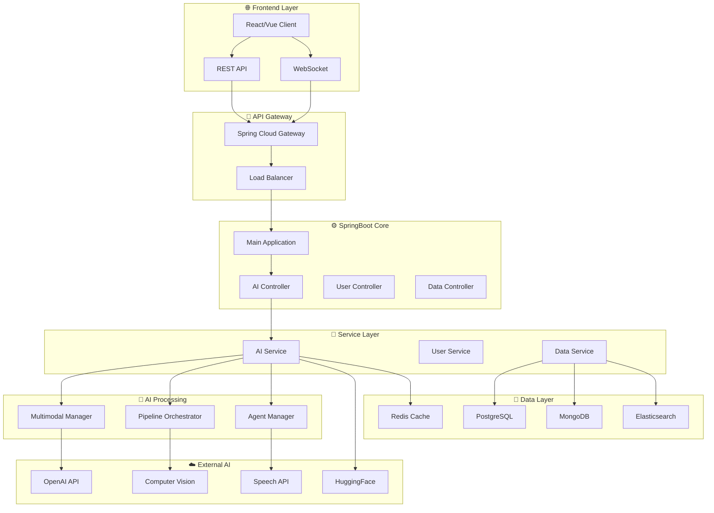

# AI 활용 고도화 시스템 구조 및 구현 가이드


---

## 1. 개요

현대 AI 시스템은 단순한 API 호출을 넘어서 **멀티모달 데이터 처리**, **파이프라인 오케스트레이션**, **사용자 맞춤형 AI**, **에이전트 기반 자동화** 등의 고도화된 기능을 요구합니다. 본 문서는 이러한 요구사항을 만족하는 실전적인 시스템 구조와 구현 방법을 제시합니다.

### 핵심 목표
- 🚀 **확장 가능한 AI 시스템 아키텍처** 설계
- ⚡ **실시간/비동기 처리** 최적화
- 🔄 **AI 파이프라인** 자동화
- 🎯 **사용자 맞춤형** 응답 시스템
- 🛡️ **안정성과 신뢰성** 확보

---

## 2. 시스템 아키텍처

### 2.1 전체 시스템 구조



### 2.2 계층별 역할

| 계층 | 역할 | 주요 기술 |
|------|------|-----------|
| **Frontend** | 사용자 인터페이스 | React, Vue, WebSocket |
| **API Gateway** | 라우팅, 로드밸런싱, 인증 | Spring Cloud Gateway, Nginx |
| **Core** | 비즈니스 로직, API 엔드포인트 | SpringBoot, Spring Security |
| **Service** | AI 서비스 오케스트레이션 | Spring AI, WebClient |
| **AI Processing** | AI 모델 관리 및 실행 | TensorFlow, PyTorch, ONNX |
| **Data** | 데이터 저장 및 캐싱 | PostgreSQL, Redis, MongoDB |

---

## 3. 핵심 구성 요소

### 3.1 멀티모달 데이터 처리

```java
@Component
public class MultimodalManager {
    
    public MultimodalResponse process(MultimodalRequest request) {
        List<ProcessingResult> results = new ArrayList<>();
        
        // 텍스트 처리
        if (request.hasText()) {
            results.add(textProcessor.process(request.getText()));
        }
        
        // 이미지 처리
        if (request.hasImage()) {
            results.add(imageProcessor.process(request.getImage()));
        }
        
        // 음성 처리
        if (request.hasAudio()) {
            results.add(audioProcessor.process(request.getAudio()));
        }
        
        return fusionProcessor.combine(results);
    }
}
```

### 3.2 Intent 분류 시스템

```java
@Service
public class IntentClassifier {
    
    public Intent classifyIntent(String userInput) {
        // 규칙 기반 분류
        Intent ruleBasedIntent = ruleEngine.classify(userInput);
        if (ruleBasedIntent.getConfidence() > 0.8) {
            return ruleBasedIntent;
        }
        
        // AI 기반 분류
        return aiClassifier.classify(userInput);
    }
}
```

---

## 4. 실시간/비동기 처리

### 4.1 실시간 처리 (동기)

```java
@RestController
public class AiController {
    
    @PostMapping("/ai/sync")
    public ResponseEntity<AiResponse> processSync(@RequestBody AiRequest request) {
        try {
            AiResponse response = aiService.processSync(request);
            return ResponseEntity.ok(response);
        } catch (Exception e) {
            return ResponseEntity.status(500)
                .body(AiResponse.error("처리 중 오류가 발생했습니다."));
        }
    }
}
```

### 4.2 비동기 처리

```java
@Service
public class AsyncAiService {
    
    @Async("aiTaskExecutor")
    public CompletableFuture<AiResponse> processAsync(AiRequest request) {
        return CompletableFuture.supplyAsync(() -> {
            // 장시간 AI 처리 작업
            return aiProcessor.process(request);
        }).exceptionally(throwable -> {
            log.error("비동기 AI 처리 실패", throwable);
            return AiResponse.fallback();
        });
    }
}
```

### 4.3 WebSocket을 통한 실시간 스트리밍

```java
@Component
public class AiStreamingHandler extends TextWebSocketHandler {
    
    @Override
    public void afterConnectionEstablished(WebSocketSession session) {
        log.info("WebSocket 연결 설정: {}", session.getId());
    }
    
    @Override
    protected void handleTextMessage(WebSocketSession session, TextMessage message) {
        String userInput = message.getPayload();
        
        // 스트리밍 AI 응답
        aiService.processStreaming(userInput)
            .subscribe(chunk -> {
                try {
                    session.sendMessage(new TextMessage(chunk));
                } catch (IOException e) {
                    log.error("메시지 전송 실패", e);
                }
            });
    }
}
```

---

## 5. AI 파이프라인 설계

### 5.1 파이프라인 매니저

```java
@Service
public class AiPipelineManager {
    
    public PipelineResult executePipeline(PipelineRequest request) {
        PipelineContext context = new PipelineContext(request);
        
        return pipelineSteps.stream()
            .reduce(context, this::executeStep, this::combineResults)
            .getResult();
    }
    
    private PipelineContext executeStep(PipelineContext context, PipelineStep step) {
        try {
            StepResult result = step.execute(context);
            context.addResult(step.getName(), result);
            return context;
        } catch (Exception e) {
            return handleStepFailure(context, step, e);
        }
    }
}
```

### 5.2 파이프라인 단계 정의

```java
public interface PipelineStep {
    String getName();
    StepResult execute(PipelineContext context);
    boolean canExecute(PipelineContext context);
}

@Component
public class TextSummaryStep implements PipelineStep {
    
    @Override
    public StepResult execute(PipelineContext context) {
        String text = context.getInput(String.class);
        String summary = summaryService.summarize(text);
        return StepResult.success(summary);
    }
}
```

---

## 6. 사용자 입력 기반 모델 라우팅

### 6.1 라우팅 전략

```java
@Component
public class ModelRouter {
    
    public ModelEndpoint selectModel(UserInput input) {
        Intent intent = intentClassifier.classify(input.getText());
        
        return switch (intent.getType()) {
            case TEXT_GENERATION -> textGenerationModel;
            case IMAGE_ANALYSIS -> imageAnalysisModel;
            case TRANSLATION -> translationModel;
            case SUMMARIZATION -> summarizationModel;
            default -> defaultModel;
        };
    }
}
```

### 6.2 동적 모델 선택

```java
@Service
public class DynamicModelSelector {
    
    public List<ModelEndpoint> selectModels(ComplexRequest request) {
        List<ModelEndpoint> selectedModels = new ArrayList<>();
        
        // 입력 복잡도 분석
        ComplexityAnalysis analysis = complexityAnalyzer.analyze(request);
        
        if (analysis.requiresMultipleModels()) {
            selectedModels.addAll(getComplementaryModels(analysis));
        } else {
            selectedModels.add(getBestSingleModel(analysis));
        }
        
        return selectedModels;
    }
}
```

---

## 7. 에러 핸들링 및 Fallback

### 7.1 Circuit Breaker 패턴

```java
@Component
public class AiServiceWithCircuitBreaker {
    
    @CircuitBreaker(name = "ai-service", fallbackMethod = "fallbackResponse")
    @TimeLimiter(name = "ai-service")
    public CompletableFuture<AiResponse> callAiService(AiRequest request) {
        return CompletableFuture.supplyAsync(() -> externalAiClient.process(request));
    }
    
    public CompletableFuture<AiResponse> fallbackResponse(AiRequest request, Exception ex) {
        log.warn("AI 서비스 호출 실패, Fallback 응답 반환", ex);
        return CompletableFuture.completedFuture(
            AiResponse.fallback("일시적으로 서비스를 이용할 수 없습니다.")
        );
    }
}
```

### 7.2 다단계 Fallback

```java
@Service
public class FallbackManager {
    
    public AiResponse processWithFallback(AiRequest request) {
        // 1차: 주 모델 시도
        try {
            return primaryModel.process(request);
        } catch (Exception e) {
            log.warn("주 모델 실패, 보조 모델 시도", e);
        }
        
        // 2차: 보조 모델 시도
        try {
            return secondaryModel.process(request);
        } catch (Exception e) {
            log.warn("보조 모델 실패, 캐시된 응답 시도", e);
        }
        
        // 3차: 캐시된 응답
        AiResponse cachedResponse = cacheService.getCachedResponse(request);
        if (cachedResponse != null) {
            return cachedResponse;
        }
        
        // 4차: 기본 응답
        return AiResponse.defaultResponse();
    }
}
```

---

## 8. 구현 예시 (SpringBoot)

### 8.1 프로젝트 구조

```
src/main/java/com/ai/system/
├── controller/
│   ├── AiController.java
│   └── WebSocketController.java
├── service/
│   ├── AiService.java
│   ├── PipelineService.java
│   └── ModelRoutingService.java
├── component/
│   ├── MultimodalManager.java
│   ├── IntentClassifier.java
│   └── FallbackManager.java
├── config/
│   ├── AiConfig.java
│   └── WebSocketConfig.java
└── dto/
    ├── AiRequest.java
    └── AiResponse.java
```

### 8.2 설정 파일

```yaml
# application.yml
ai:
  models:
    openai:
      api-key: ${OPENAI_API_KEY}
      base-url: https://api.openai.com/v1
    huggingface:
      api-key: ${HF_API_KEY}
      base-url: https://api-inference.huggingface.co
  
  pipeline:
    timeout: 30s
    retry-attempts: 3
    
  fallback:
    enabled: true
    cache-duration: 1h

resilience4j:
  circuitbreaker:
    instances:
      ai-service:
        failure-rate-threshold: 50
        wait-duration-in-open-state: 10s
        sliding-window-size: 10
```

### 8.3 메인 AI 서비스

```java
@Service
@Transactional
public class AiService {
    
    private final ModelRouter modelRouter;
    private final PipelineManager pipelineManager;
    private final FallbackManager fallbackManager;
    
    public AiResponse process(AiRequest request) {
        try {
            // 1. 입력 전처리
            ProcessedInput processed = preprocessor.process(request);
            
            // 2. 모델 선택
            ModelEndpoint model = modelRouter.selectModel(processed);
            
            // 3. AI 처리
            if (request.isPipelineRequired()) {
                return pipelineManager.execute(processed, model);
            } else {
                return model.process(processed);
            }
            
        } catch (Exception e) {
            return fallbackManager.processWithFallback(request);
        }
    }
}
```

---

## 9. 고도화 전략

### 9.1 성능 최적화

- **캐싱 전략**: Redis를 활용한 응답 캐싱
- **배치 처리**: 유사한 요청들을 묶어서 처리
- **모델 최적화**: ONNX, TensorRT 등을 활용한 모델 경량화
- **비동기 처리**: CompletableFuture, WebFlux 활용

### 9.2 확장성 확보

- **마이크로서비스**: AI 기능별 서비스 분리
- **컨테이너화**: Docker, Kubernetes 활용
- **오토스케일링**: 부하에 따른 자동 확장
- **로드밸런싱**: 트래픽 분산

### 9.3 모니터링 및 관찰성

```java
@Component
public class AiMetricsCollector {
    
    private final MeterRegistry meterRegistry;
    
    public void recordProcessingTime(String modelName, Duration duration) {
        Timer.Sample sample = Timer.start(meterRegistry);
        sample.stop(Timer.builder("ai.processing.time")
            .tag("model", modelName)
            .register(meterRegistry));
    }
    
    public void recordModelAccuracy(String modelName, double accuracy) {
        Gauge.builder("ai.model.accuracy")
            .tag("model", modelName)
            .register(meterRegistry, () -> accuracy);
    }
}
```

---


## 결론

AI 활용 고도화 시스템은 **멀티모달 처리**, **파이프라인 오케스트레이션**, **지능형 라우팅**, **안정성 확보** 등의 핵심 요소들이 유기적으로 결합된 복합 시스템입니다. 본 가이드에서 제시한 구조와 구현 방법을 통해 확장 가능하고 안정적인 AI 시스템을 구축할 수 있습니다.

핵심은 **단계적 구현**과 **지속적 개선**입니다. 기본 구조부터 시작하여 점진적으로 고도화 기능을 추가해나가는 것이 성공적인 AI 시스템 구축의 열쇠입니다.