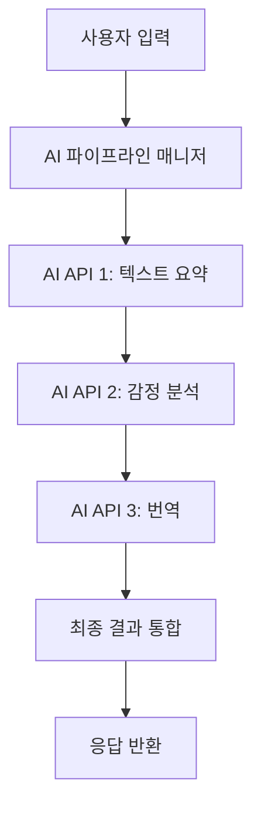

# Advanced-AI-System-Architecture : AI 파이프라인 SpringBoot 구현 가이드

## 목차
- [1. 개요 및 구조](#1-개요-및-구조)
- [2. 주요 설계 포인트](#2-주요-설계-포인트)
- [3. 핵심 코드 예시](#3-핵심-코드-예시)
- [4. 실전 구현 팁](#4-실전-구현-팁)
- [5. 참고 오픈소스/자료](#5-참고-오픈소스자료)

---

## 1. 개요 및 구조

여러 AI API(예: 텍스트 요약 → 감정 분석 → 번역 등)를 순차적으로 호출해 복합 결과를 만드는 파이프라인 구조는 실제 서비스에서 매우 유용함. SpringBoot에서는 Service 계층에서 각 AI API를 모듈화하고, 순차 호출 및 예외처리, 결과 통합을 담당하는 파이프라인 매니저 클래스를 설계하는 것이 핵심.

### 예시 아키텍처 다이어그램


---

## 2. 주요 설계 포인트
- **Service 분리**: 각 AI API 호출을 별도 Service 클래스로 분리
- **파이프라인 매니저**: 순차 호출, 결과 전달, 예외처리 담당
- **비동기/동기 처리**: 상황에 따라 `CompletableFuture` 등 비동기 처리 고려
- **에러 핸들링**: 각 단계별 예외 발생 시 graceful degradation(부분 결과 반환 등)
- **결과 통합**: 각 단계 결과를 DTO로 관리, 최종 응답에 통합

---

## 3. 핵심 코드 예시

### 1) 각 AI API Service 예시
```java
@Service
public class SummaryService {
    public String summarize(String text) {
        // 외부 요약 API 호출 (RestTemplate/WebClient 등)
        // ...
        return summaryResult;
    }
}

@Service
public class SentimentService {
    public String analyze(String text) {
        // 외부 감정 분석 API 호출
        // ...
        return sentimentResult;
    }
}

@Service
public class TranslationService {
    public String translate(String text, String targetLang) {
        // 외부 번역 API 호출
        // ...
        return translatedResult;
    }
}
```

### 2) 파이프라인 매니저 예시
```java
@Service
public class AiPipelineManager {
    @Autowired SummaryService summaryService;
    @Autowired SentimentService sentimentService;
    @Autowired TranslationService translationService;

    public AiPipelineResult process(String input, String targetLang) {
        String summary = summaryService.summarize(input);
        String sentiment = sentimentService.analyze(summary);
        String translated = translationService.translate(sentiment, targetLang);
        return new AiPipelineResult(summary, sentiment, translated);
    }
}
```

### 3) DTO 예시
```java
public class AiPipelineResult {
    private String summary;
    private String sentiment;
    private String translated;
    // 생성자, getter/setter 생략
}
```

### 4) Controller 예시
```java
@RestController
@RequestMapping("/api/ai-pipeline")
public class AiPipelineController {
    @Autowired AiPipelineManager aiPipelineManager;

    @PostMapping
    public ResponseEntity<AiPipelineResult> runPipeline(@RequestBody AiPipelineRequest req) {
        AiPipelineResult result = aiPipelineManager.process(req.getText(), req.getTargetLang());
        return ResponseEntity.ok(result);
    }
}
```

---

## 4. 실전 구현 팁
- **RestTemplate보다 WebClient 사용 권장** (비동기/성능)
- **API Key, URL 등은 application.yml로 분리**
- **각 단계별 timeout/재시도 정책 적용**
- **로깅/모니터링(Actuator, AOP) 적극 활용**
- **테스트: 각 Service 단위 테스트 + 통합테스트**
- **실제 서비스에서는 Circuit Breaker(Resilience4j 등) 적용 권장**

---

## 5. 참고 오픈소스/자료
- [Spring AI 공식 문서](https://docs.spring.io/spring-ai/reference/)
- [ai-beehive (SpringBoot 기반 AI 챗봇)](https://github.com/hncboy/ai-beehive)
- [SpringBoot+OpenAI 연동 예제](https://github.com/qq418745/spring-ai-example)
- [Spring WebClient 공식 문서](https://docs.spring.io/spring-framework/docs/current/reference/html/web-reactive.html#webflux-client)
- [Resilience4j Circuit Breaker](https://resilience4j.readme.io/docs/circuitbreaker) 
