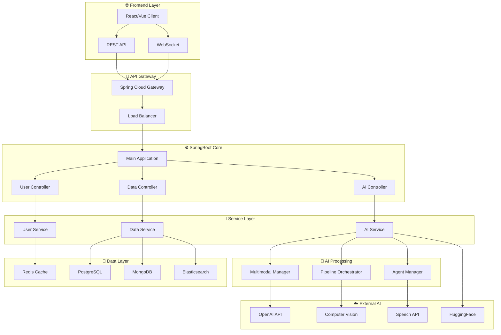
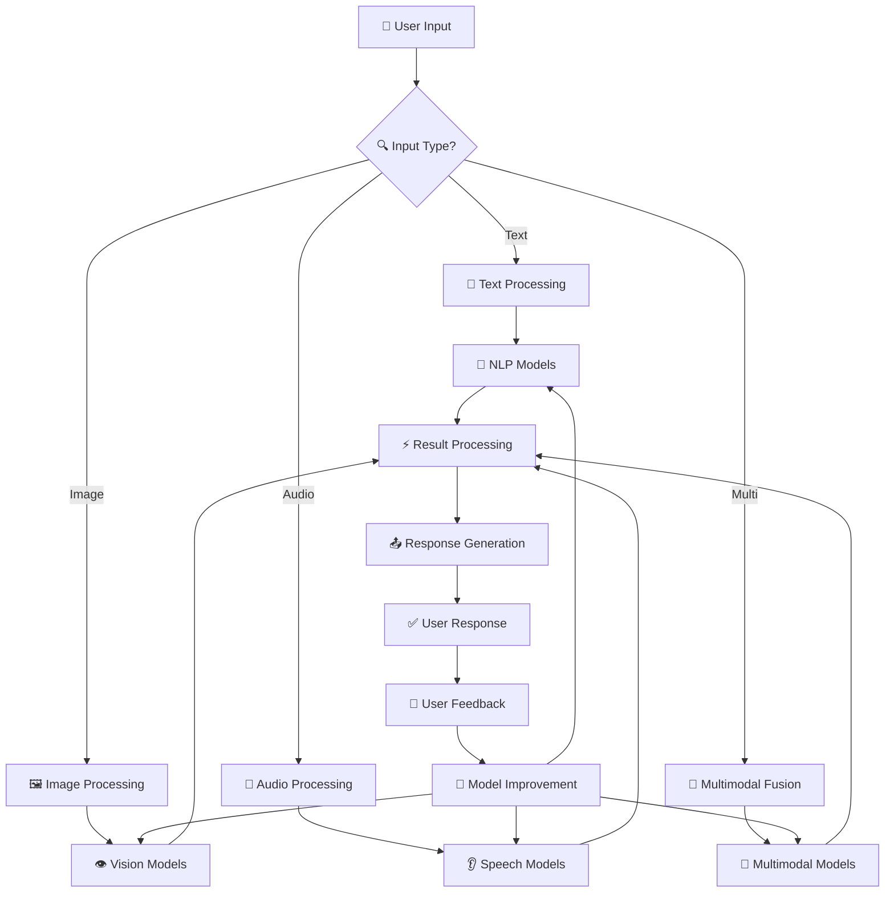
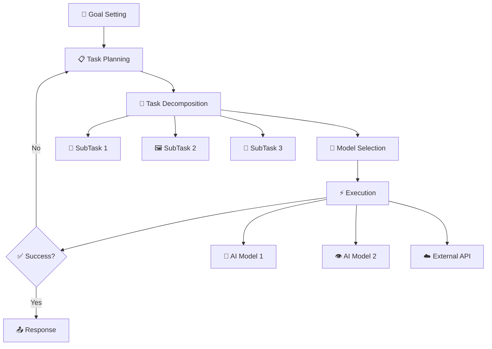
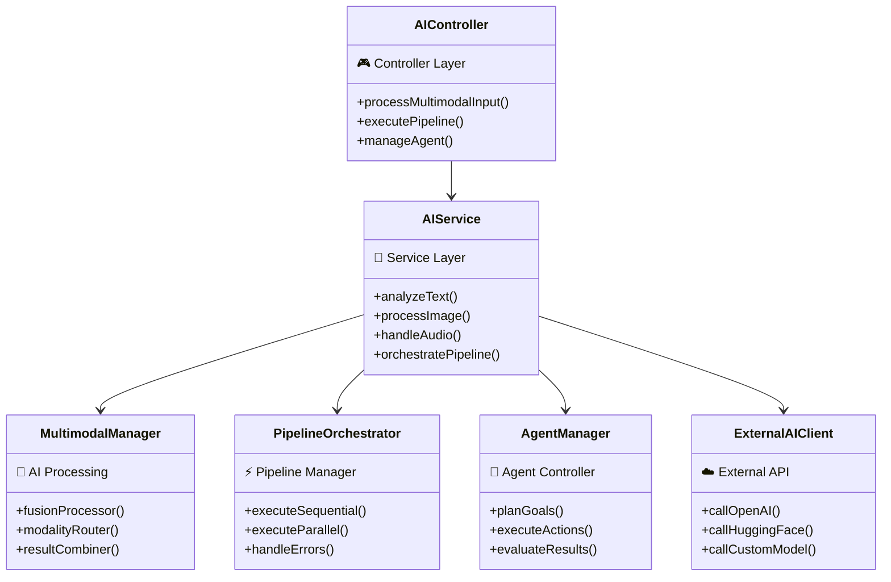

# Advanced-AI-System-Architecture : 예시 및 활용방안

## 목차
- [1. AI를 고도하게 응용 가능한 방안 및 예시](#1-ai를-고도하게-응용-가능한-방안-및-예시)
- [2. AI 활용 시스템의 구조 및 고도화 가이드 - SpringBoot](#2-ai-활용-시스템의-구조-및-고도화-가이드---springboot)

---

## 1. AI를 고도하게 응용 가능한 방안 및 예시

### 1) 멀티모달 데이터 활용
- **설명**: 텍스트, 이미지, 음성 등 다양한 데이터 타입을 결합하여 AI가 더 풍부한 정보를 처리하도록 설계
- **실제 예시**:
  - [Multimodal-Classification (ENSTA Paris)](https://github.com/caiolang/Multimodal-Classification): 이미지+오디오 데이터를 활용한 환경 분류 프로젝트. Kaggle 데이터셋을 활용해 이미지와 오디오를 결합한 분류 모델을 개발, 단일 모달 대비 정확도 대폭 향상.
  - [KAIST 멀티모달 이미지-텍스트 검색](https://github.com/SuperSupermoon/mmodal_mixer): 의료 영상과 리포트(텍스트)를 결합한 멀티모달 검색.
  - [Text-to-Image Generation & 챗봇 통합](https://medium.com/@nairaaalot99/text-to-image-generation-model-augmented-chatbot-a42c5000d4a): GAN 기반 텍스트-이미지 생성, 챗봇과 통합하여 예술치료, 뉴스 시각화 등 다양한 활용.

### 2) 파이프라인 및 오케스트레이션
- **설명**: 여러 AI 모델(예: 텍스트 요약, 감정 분석, 번역 등)을 순차적으로 연결하여 복합적인 결과 도출. Airflow, Prefect, Mage, DVC, MLflow 등 오케스트레이션 도구 활용.
- **실제 예시**:
  - [Mega Pipeline (dlops-io)](https://github.com/dlops-io/mega-pipeline): 오디오→텍스트→LLM→TTS→번역→TTS 등 복합 AI 파이프라인을 Docker와 GCP, Airflow로 오케스트레이션.
  - [ML_pipeline (AlexandreManai)](https://github.com/AlexandreManai/ML_pipeline): DVC, MLflow, Airflow, Docker를 활용한 MLOps 파이프라인 예시.
  - [ai_coustics (Airflow+Audio)](https://github.com/namitkharade/ai_coustics): 오디오 데이터 크롤링, 분류, 품질 평가를 Airflow로 자동화.

### 3) 사용자 맞춤형 AI
- **설명**: 사용자의 행동, 선호 데이터를 수집·분석하여 개인화된 결과 제공. 추천 시스템, 맞춤형 챗봇 등.
- **실제 예시**:
  - [AIStudyAssistant (MCIT Hackathon)](https://github.com/PaulJKathmann/AIStudyAssistant): OpenAI API와 게이미피케이션을 결합한 맞춤형 학습 어시스턴트.
  - [Casey Scholar (MBA 학생용 AI)](https://medium.com/@nicholaiyu/i-made-an-ai-for-mba-students-ae8c4b6a850f): 강의자료 기반 맞춤형 답변, 인용 제공, 실제 대학생 대상 활용.

### 4) 에이전트 기반 자동화
- **설명**: 단순 API 호출이 아닌, 목표 지향적 에이전트가 여러 작업을 자동으로 수행. 예: Runner H, AgentGPT, LangChain Agents 등.
- **실제 예시**:
  - [AgentGPT (웹 기반 에이전트)](https://agentgpt.reworkd.ai/): 목표와 도구를 설정하면 스스로 계획을 세우고 실행하는 오픈소스 에이전트.
  - [Runner H 활용 사례](https://dev.to/rithika_b7c2a7813e2912064/runner-h-as-my-academic-research-assistant-exploring-women-in-tech-education-26no): 논문 검색, 요약, 이메일 작성 등 복합 작업을 한 번에 자동화.
  - [AI Internship Application Assistant](https://dev.to/illona/ai-internship-application-assistant-built-with-runner-h-4b14): 인턴십 검색, 지원 이메일 작성, Notion 연동, 팔로우업까지 자동화.
  - [AI Agents for Beginners (HackerNoon)](https://hackernoon.com/ai-agents-for-beginners-building-your-first-ai-agent): Python+OpenAI+API 연동으로 진짜 에이전트 구현 튜토리얼.

### 5) 실시간/온디바이스 AI
- **설명**: 서버가 아닌 로컬(모바일, PC, IoT)에서 AI를 실행하여 빠른 응답과 프라이버시 보장. 예: 음성 인식, 실시간 번역, CCTV, IoT 등.
- **실제 예시**:
  - [AIRCCTV (YOLOv5+Raspberry Pi)](https://github.com/ghdi1ghdi/AIRCCTV): 라즈베리파이에서 실시간 객체 인식 및 녹화.
  - [Automatic-rotating-fan-module-using-AI](https://github.com/Dev-HJYoo/Automatic-rotating-fan-module-using-AI): 온디바이스 객체 인식 기반 자동 선풍기.
  - [EyesON (졸음운전 방지)](https://github.com/inerplat/EyesON): 임베디드+AI로 졸음운전 감지 및 경고.

### 6) AI+규칙 기반 하이브리드 시스템
- **설명**: AI 모델과 전통적 규칙 기반 시스템을 결합하여 신뢰성과 유연성 확보. 예: 의료, 법률, 교육 등에서 활용.
- **실제 예시**:
  - [I-OnAR: Rule-based ML for E-Learning](https://ijeecs.iaescore.com/index.php/IJEECS/article/view/20626): 규칙기반+머신러닝으로 온라인 학습 평가 및 피드백 자동화.
  - [Hybrid LLM+Rule-Based System](https://medium.com/@ceciliabonucchi/bridging-intelligence-the-next-evolution-in-ai-with-hybrid-llm-and-rule-based-systems-db0d89998c6d): LLM과 규칙엔진을 결합한 하이브리드 구조 설명 및 사례.
  - [Rule-based_Expert_System (Fudan)](https://github.com/Sorosliu1029/Rule-based_Expert_System): 규칙기반 전문가 시스템 예제(도형 인식 등).

---

## 2. AI 활용 시스템의 구조 및 고도화 가이드 - SpringBoot

### 1) 기본 구조
- **클라이언트**: 웹/모바일 프론트엔드 (React, Vue 등)
- **SpringBoot 백엔드**: REST API 서버, AI 서비스 오케스트레이션 담당
- **AI 서비스**: 외부 AI API(OpenAI, HuggingFace 등) 또는 자체 모델 서버
- **DB**: 사용자 데이터, 로그, 피드백 저장 (MySQL, MongoDB 등)

### 2) 고도화 전략
- **AI 파이프라인 구현**: SpringBoot에서 여러 AI API를 순차/병렬 호출, 결과를 통합하여 응답
- **비동기 처리**: AI 연산이 오래 걸릴 경우, Spring의 비동기/이벤트 기반 처리로 사용자 경험 개선
- **사용자 피드백 루프**: 사용자의 평가/피드백을 DB에 저장, AI 결과 개선에 활용
- **멀티모달 지원**: 파일 업로드(이미지, 음성 등) 및 다양한 입력 지원 API 설계
- **보안 및 프라이버시**: 인증/인가, 데이터 암호화, 민감정보 마스킹 등 적용

### 3) 실제 구현/아키텍처 참고자료
- [Spring AI 공식 문서](https://docs.spring.io/spring-ai/reference/): SpringBoot에서 OpenAI, HuggingFace 등 다양한 AI 모델 연동 방법, 프롬프트 관리, 비동기 처리 등 실습 예제 포함
- [Spring AI Example (qq418745)](https://github.com/qq418745/spring-ai-example): SpringBoot+OpenAI 연동 예제, 프론트엔드와의 통신 구조 참고
- [ai-beehive (SpringBoot 기반 AI 챗봇)](https://github.com/hncboy/ai-beehive): SpringBoot 3, JDK 17 기반, ChatGPT, Midjourney, Bing 등 다양한 AI API 통합, 실서비스 구조 참고
- [How AI Can Be Integrated Into a Spring Boot Applications: Spring AI](https://medium.com/@swatisv11/how-ai-can-be-integrated-into-a-spring-boot-applications-spring-ai-779f88438a65): SpringBoot+OpenAI로 맞춤형 다이어트 플랜 생성기 구현 튜토리얼(React 프론트+SpringBoot 백엔드+OpenAI API)
- [Creating an AI Agent with Spring Boot: A Real-World Use Case](https://master-spring-ter.medium.com/creating-an-ai-agent-with-spring-boot-a-real-world-use-case-620d02b23656): SpringBoot 기반 AI 에이전트(챗봇) 실제 구현 사례
- [Restackio: SpringBoot 기반 AI 에이전트/워크플로우 프레임워크](https://www.restack.io/p/feature-based-ai-software-development-answer-java-spring-boot-ai-integration-cat-ai): 장기 실행, 워크플로우, API 엔드포인트, 큐, 스케줄링 등 엔터프라이즈급 AI 시스템 구조 참고

### 4) 예시 아키텍처 다이어그램

**전체 시스템 아키텍처:**

**AI 파이프라인 상세 구조:**

**에이전트 기반 자동화 구조:**

**SpringBoot AI 시스템 클래스 구조:**

### 5) 참고 오픈소스/기술
- SpringBoot, Spring WebFlux, JPA
- OpenAI API, HuggingFace Transformers, Spring AI
- Apache Airflow(파이프라인), Redis(캐시)
- Docker, GitHub Actions(CI/CD)

